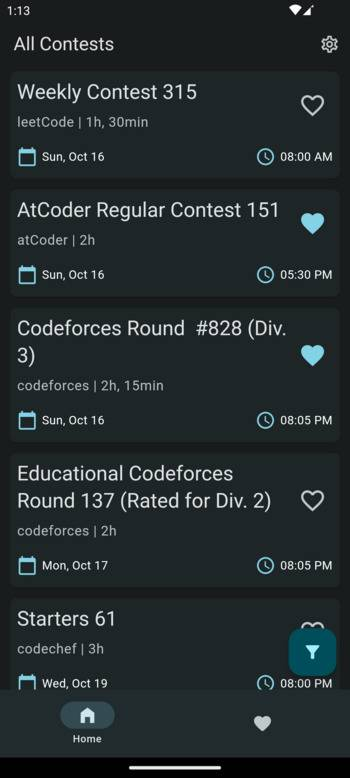
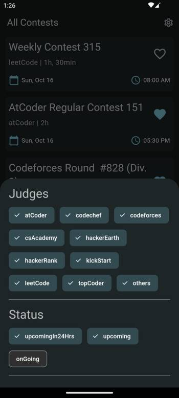
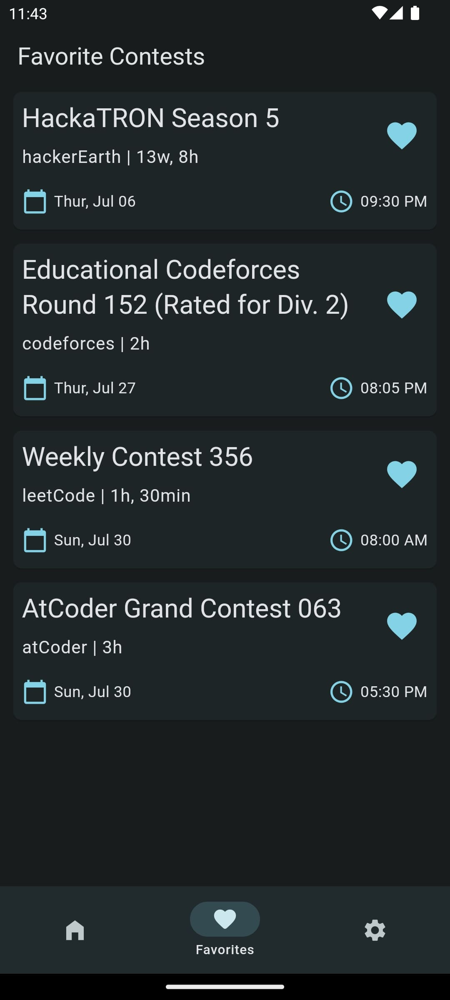
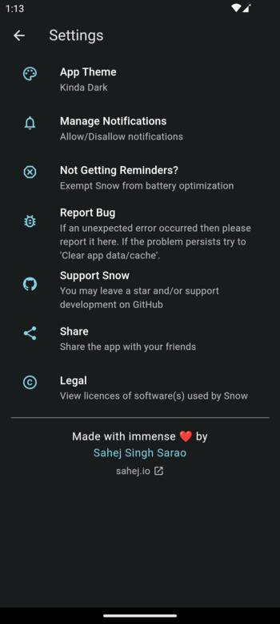
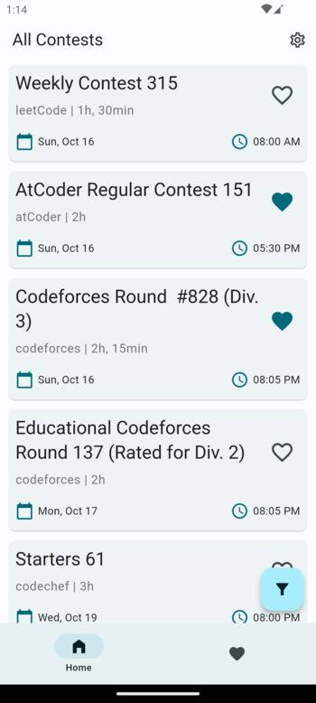
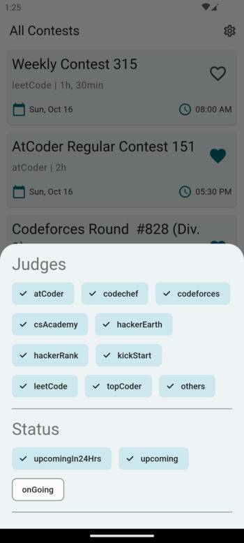
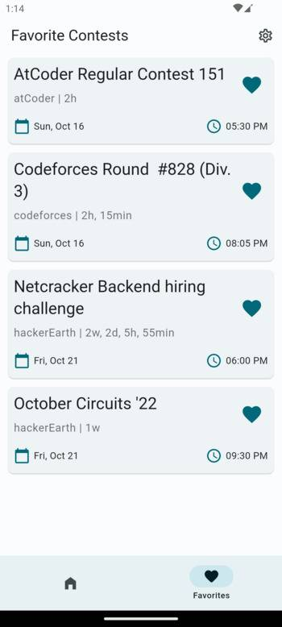
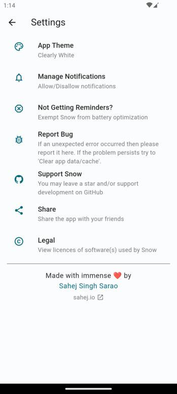

<div align="center">
  </img>
  <h1 align="center">✨ Snow ✨</h1>
</div>


# Coding Contests Reminders for Competitive Programmers

| <a href="https://apt.izzysoft.de/packages/com.sahej.snow/" target="_blank" rel="noopener"> </img> </a> | <a href="https://play.google.com/store/apps/details?id=com.sahej.snow" target="_blank" rel="noopener"> </img> </a> |
| :-: | :-: |

# About
Snow is a simple, beautiful, no non-sense, cross-platform  mobile app which gives reminders about upcoming programming contests.

## Screenshots

### Dark Theme
| </img> | </img> | </img> | </img> |
| :-: | :-: | :-: | :-: |
| Home | Filters | Favorites | Settings |

### Light Theme
| </img> | </img> | </img> | </img> |
| :-: | :-: | :-: | :-: |
| Home | Filters | Favorites | Settings |

## Features
- View upcoming and ongoing contests from supported platforms
- 10+ supported platforms, including At Coder, Codeforces, Hacker Earth etc.
- Favorite a contest to receive reminders before its start time
- Dynamic, Dark, and Light theme support
- Beautifully designed with Material3 (You) design spec
- Privacy focused as all data is stored on device ([more info](#privacy-policy))
- Easy registrations: tap a contest's name to directly open its webpage
- Choose a custom accent color and express yourself
- Customize reminder timings ([upcoming](#roadmap))


# Installation

## Method 1: Play Store
[Click Here to Download from Play Store](https://play.google.com/store/apps/details?id=com.sahej.snow)

## Method 2: Build from Source

### Prerequisites
You need to have the following installed before proceeding:
- Git ([Install Instructions](https://git-scm.com/book/en/v2/Getting-Started-Installing-Git))
- Flutter ([Install Instructions](https://docs.flutter.dev/get-started/install))

Please ensure that git and flutter are properly setup and working on your machine before proceeding.

### Instructions
Clone this repository recusrsively because there are some submodule dependencies. You can do that by typing the following in your terminal (on Linux, macOS), or in Powershell (on Windows):
```bash
git clone --recursive https://www.github.com/sahej-dev/snow.git
```
> ⚠️ Warning: Do NOT forget to include the `--recursive` flag, because without it you would not have all the dependencies required by Snow. This is because some dependencies are git submodules.

Then change the working directory to the newly created `snow` directory by typing:
```bash
cd snow
```
Now you can build the apk by typing
```bash
flutter build apk --release
```

You can safely ignore the big wall of red text as long as it says "Running Gradle task 'assembleRelease'...". Finally it should say "<span style="color:#43C731">✓  Built build/app/outputs/flutter-apk/app-release.apk (46.0MB)</span>".

Navigate to the above mentioned directory using your file explorer, and transfer `app-release.apk` to your Android device. If you are unable to locate `app-release.apk` then type the following in your terminal after it is done with the previous step:
```bash
cp ./build/app/outputs/flutter-apk/app-release.apk ~/Desktop
```
Now you should be able to find the `app-release.apk` on your desktop.

# Support
If you have run into an issue while using the app then try clearing the app cache and data. If that does not solve the problem then feel free to report it on the [issues page](https://github.com/sahej-dev/Snow/issues). Reported bugs tend to be quashed sooner.

# Development

## Roadmap
The following features, in no particular order, are planned to be added to Snow:

- [x] Ability to sort contests
- [x] Custom accent color chooser (overwriting wallpaper accent color)
- [ ] Custom notification timings chooser


## Contributing
You are welcome to contribute to Snow. If you are a developer familiar with Flutter then feel free to submit a pull request (PR) for any of the open issues. You can even create an issue for a feature in the [roadmap](#roadmap), if it does not have one already, and then submit a PR for the same.

If you are not familiar with Flutter, you can still contribute by opening new issues for bug reports, feature requests, and/or enhancements that you would like to as a user.

If you are not a programmer but woule like to support Snow you can do that:
- By leaving a star on the repository
- By telling your friends about Snow

Please read [CONTRIBUTING.md](CONTRIBUTING.md) before making a contribution.

## Contributors
- [Sahej A. Singh](https://www.sahej.io): Designer and developer
- [IzzyOnDroid](https://android.izzysoft.de/): All the hard work for app-store hosting of Snow
- [Pratik Jindal](https://github.com/jindalpratik): Adaptive icon support for Android 13+

# Background
Snow was originally a Discord bot that me and a friend made during online university in 2020, which supported only two platforms: CodeChef and Codeforces. Later it evolved into a, now discontinued, mobile app (now called [Snow Classic](https://github.com/sahej-dev/Snow/tree/classic)). Snow Classic had a static and hardcoded light theme, used provider (in a very bad way) to manage state, and notifications did not work on my OnePlus device but worked flawlessly on a friend's Samsung. Being very new to app development at the time, Snow Classic of course turned out to have very bad architecture (if it had one at all). It worked but changing, adding anything was a pain. So I began a rewrite of the app, and this is what we have.

# Acknowledgements
Special thanks to these amazing projects and their authors which power Snow:
- [KONTESTS](https://kontests.net)
- [bloc](https://bloclibrary.dev/#/)
- [IzzyOnDroid F-Droid Repository](https://apt.izzysoft.de/fdroid)

# Legal
## License
Snow is free and open source software under the terms of MIT License. More details can be found on the [LICENSE](https://github.com/sahej-dev/Snow/blob/main/LICENSE) page.

## Privacy Policy
Only accesses the internet to fetch contest details. Thats it. No other calling back home.

A lot of contests' and other urls are present in the app though, and when visiting those websites then you should look at their privacy policies.
