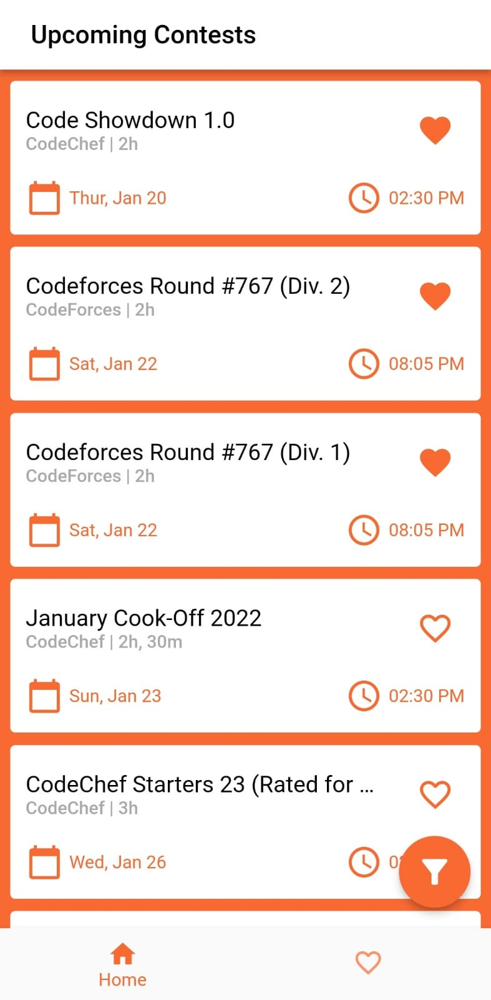
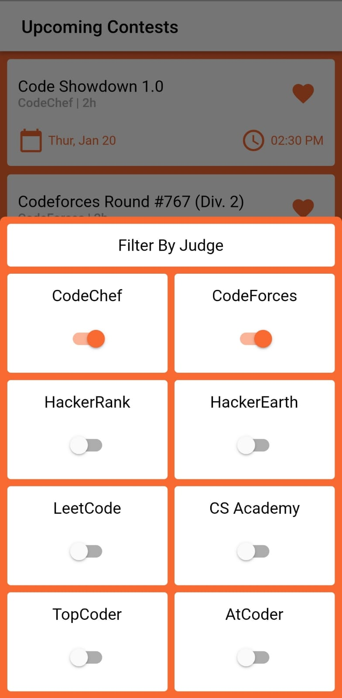
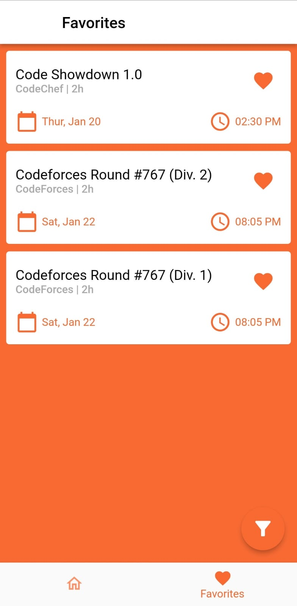

# Snow

Snow is supposed to be a mobile app with information about all the coding contests on different websites, all in one place. Users can choose which contests to recieve periodic reminders about. This is a personal project, that I started in as my second year in university started. As the university started the development has come to a halt, as this is a side project, but I expect to finish this app before starting my third year at the university, so before August 2022.

I have developed it completely using Flutter and <a href="https://kontests.net/">this</a> amazing API, which made my life easier. You can find the pre-alpha release <a href="https://github.com/sahej-dev/Snow/releases/tag/v0.0.1-pre-alpha">here</a>. This is a work-in-progress and not a complete app by any means. Data fetching, parsing, organisation, and presentation to user is completely done. Reminders have some bugs that needs to be quashed.

## Screenshots
(Following are from a very much work-in-progress pre-alpha version of the app)

  
  
  

### How Snow Came to Be
Snow started out as a discussion among friends. 6-7 of use were quite active in competitive programming leading up to the summer vacations, and we usually hung around on Discord (Pandemic so online university). So me and one of my friends (Palash) decided to make our own discord bot which will tell us about contests from Codechef & Codeforces. It was a simple discord bot, we made it in Python and hosted it. A few weeks later I thought of making a mobile app (sadly Palash wasn't interested in this) which could also give reminders for upcoming contests, and it would also help me learn in-depth app development.
